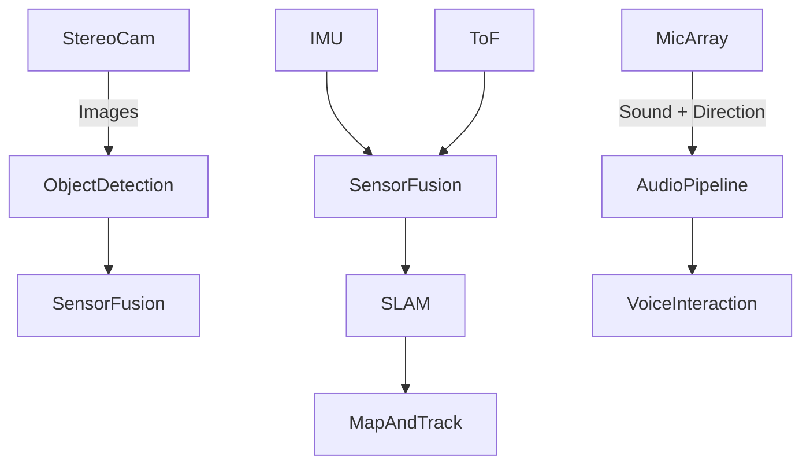

# BALL·E Perception System

BALL·E's perception system enables it to understand and interpret the physical world using multiple sensors and intelligent processing, both onboard and via the smart base.

---

## Goals

- Build a lightweight and robust multi-modal perception pipeline
- Enable accurate mapping and localization using stereo vision
- Detect and recognize faces, people, and objects
- Support emotionally-aware interactions (e.g., detect user engagement)
- Allow future upgrades like gesture recognition or visual question answering

---

##  Core Components

### 1. Visual Perception
- **Stereo Camera**: Primary depth estimation and visual SLAM
- **YOLO-based Person/Object Detection**:
  - Fast, local person detection
  - Optional open-vocabulary detection via YOLO-World or CLIP later
- **Face Detection & Recognition**:
  - Local face embeddings + memory lookup
  - Personalized reactions per known face

### 2. Spatial Awareness
- **IMU (Gyroscope/Accelerometer)**:
  - Orientation tracking
  - Visual-Inertial Odometry (VIO)
- **ToF / Ultrasonic Sensors**:
  - Close-range obstacle avoidance
  - Autonomous docking and edge detection
- **Optional IR or Radar Add-ons**:
  - IR depth camera for low-light enhancement
  - mmWave radar for ambient motion detection (privacy-safe)

### 3. Audio Perception
- **Microphone Array**:
  - Voice activity detection (VAD)
  - Direction of arrival (DoA) estimation
  - Wake-word detection

## 4. Enviromental Awarness
- **Ambient Light Sensor**: For detecting lighting conditions, time-of-day context, mood adaptation (e.g., dim eyes at night)
- Future: temperature sensor

---

## Data Flow

- Low-level sensor fusion happens onboard
- High-level processing (SLAM, detection, recognition) occurs on the docking station
- Result: A semantic map with dynamic context understanding

---

## Tools & Frameworks

| Task             | Tools                                               |
| ---------------- | --------------------------------------------------- |
| Object Detection | YOLOv5/YOLOv8                                       |
| Face Recognition | InsightFace or MobileFaceNet                        |
| SLAM             | ORB-SLAM3 or VINS-Fusion                            |
| Sensor Fusion    | ROS2, robot_localization                            |
| Audio            | Vosk (local STT), Porcupine (wake word), custom DoA |

---

## Future Additions

- Gesture tracking (e.g., waving, pointing)
- Emotion recognition from face and voice
- Environmental context (e.g., lighting, activity level)
- Spatial audio interaction and mood-adaptive responses